# comet-browser-agent-clone

A Python-based browser automation agent with step-based workflow pipeline for automated web interactions.

## 🗺️ System Architecture

```mermaid
flowchart TD
    subgraph Config["⚙️ CONFIGURATION"]
        Targets["📄 targets.yaml"]
        State["💾 step_state.json"]
    end

    subgraph Agent["🤖 BROWSER AGENT"]
        direction TB
        Main["🚀 Main Controller"]
        
        subgraph Pipeline["🔄 STEP PIPELINE"]
            Step1["🎯 Open Targets"]
            Step2["📜 Browser Script"]
            Step3["📸 Screenshots"]
        end
        
        StateManager["📊 State Manager"]
    end

    subgraph Output["📤 OUTPUT"]
        Logger["📝 Log & Chat"]
        Email["📧 Email Report"]
        Summary["📋 Final Summary"]
    end

    Targets -->|Load Steps| Main
    State -->|Resume Point| Main
    Main --> Step1
    Step1 --> Step2
    Step2 --> Step3
    Step3 --> StateManager
    StateManager -->|Save Progress| State
    StateManager --> Logger
    Logger --> Summary
    Summary --> Email

    style Config fill:#FFF9C4,color:#000
    style Agent fill:#40C4D4,color:#000
    style Output fill:#4CAF50,color:#fff
    style Pipeline fill:#E3F2FD,color:#000
```

## Features

- **Step-based workflow**: Execute automation in defined stages
- **State persistence**: Resume from last checkpoint on restart
- **Screenshot capture**: Document each step visually
- **Logging & Chat**: Track progress with detailed logs
- **Email reports**: Automatic summary delivery

## Tech Stack

- Python 3.x
- YAML configuration
- JSON state management
